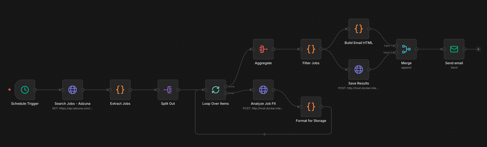
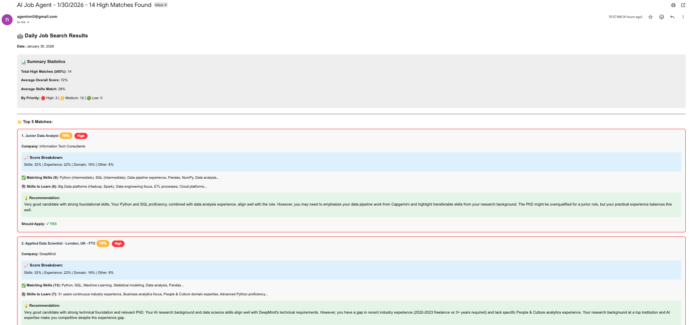
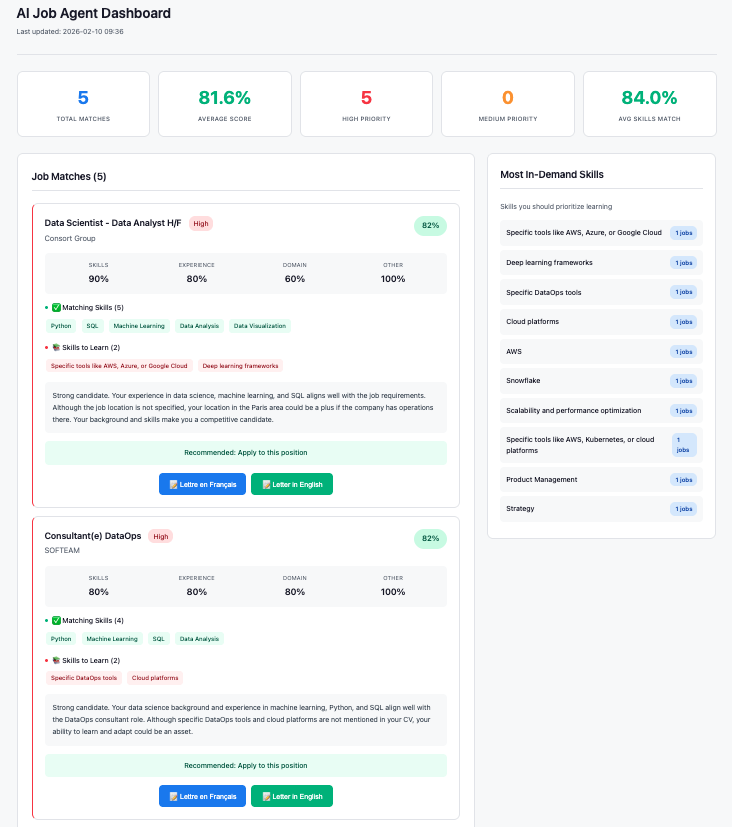

# AI Job Application Agent


An intelligent job search assistant that uses AI to analyze job postings, match them with your CV, generate cover letters, and email you daily recommendations — fully automated and deployed on Railway.

### Live Demo
- **Dashboard & API:** https://web-production-134c0.up.railway.app
- **n8n Workflow:** https://ai-job-agent-production-91f0.up.railway.app


## What It Does

- **Searches for jobs daily** across job boards using Adzuna API
- **AI-powered job fit analysis** using Groq (LLaMA 3.3 70B) via LangChain
- **Scoring system** (0-100) with 4-component breakdown and filters results to show only relevant opportunities (>= 50% match)
- **Identifies matching and missing skills** for each job
- **Generates tailored cover letters** in French or English
- **Emails you daily** with top matches and detailed recommendations via Resend API
- **Web dashboard** with statistics, job cards, and cover letter generation
- **Fully automated** via n8n workflow running on Railway


## Screenshots

### n8n Automation Workflow

*Complete automation pipeline: search -> analyze -> filter -> save -> email*

### Email Notification

*Daily email with top job matches and AI recommendations*

### Dashboard View

*Real-time job matching dashboard with statistics, scores, and skill analysis*


## Tech Stack

| Layer | Technology |
|-------|-----------|
| **Backend** | Python 3.11, Flask, Gunicorn |
| **AI** | Groq API (LLaMA 3.3 70B), LangChain |
| **Automation** | n8n (workflow orchestration) |
| **Job Search** | Adzuna API |
| **Email** | Resend API |
| **Hosting** | Railway (Flask app + n8n) |
| **Frontend** | Jinja2 Templates, Custom CSS |
| **Containerization** | Docker (n8n) |


## How It Works

```
┌─────────────┐
│   n8n        │  Scheduler (daily at 9am)
└──────┬──────┘
       │
       ▼
┌──────────────┐         ┌─────────────────┐
│ Adzuna API   │──jobs──>│  Flask API       │
│ Job Search   │         │  Groq AI Analysis│
└──────────────┘         └────────┬────────┘
                                  │
                                  ▼
                        ┌─────────────────┐
                        │  Filter (>=50)  │
                        │  Save Results   │
                        └───────┬─────────┘
                                │
                    ┌───────────┼───────────┐
                    ▼                       ▼
          ┌─────────────────┐    ┌─────────────────┐
          │  Resend Email   │    │   Dashboard      │
          │  Daily Digest   │    │   + Cover Letters│
          └─────────────────┘    └─────────────────┘
```


## Components

### Flask App (`main.py`)
Single combined server (API + Dashboard) deployed on Railway:
- **`/analyze-fit`** — AI-powered job fit analysis against your CV
- **`/generate-cover-letter`** — Bilingual cover letter generation (FR/EN)
- **`/save-results`** — Persist job analysis results
- **`/`** — Web dashboard with statistics, job cards, and cover letter generation
- **`/api/jobs`** and **`/api/stats`** — JSON endpoints for job data

**Scoring System:**
- Skills Match (40 points): Technical skills alignment
- Experience Level (30 points): Seniority fit
- Domain/Industry (20 points): Relevant domain knowledge
- Other Factors (10 points): Location, culture fit, etc.

### n8n Workflow
Automated pipeline running on Railway:
- **Schedule Trigger** — Runs daily at 9am
- **Adzuna API** — Searches for Data Scientist / Data Analyst jobs
- **Loop + Analyze** — Each job analyzed by AI against your CV
- **Filter** — Only keeps jobs scoring >= 50%
- **Save Results** — Sends results to Flask API for dashboard
- **Build Email** — Generates HTML email with top matches
- **Resend API** — Delivers daily email digest

### Cover Letter Generator (`cover_letter_generator.py`)
- Generates personalized cover letters using Groq (LLaMA 3.3 70B)
- Supports French and English based on job language
- Accessible from dashboard (one-click per job) and API


## Setup

### Prerequisites
- Python 3.11+
- Groq API key
- Adzuna API credentials
- Resend API key (for email)

### Local Development

1. Clone and set up:
```bash
git clone https://github.com/h4y4h0o/ai-job-agent.git
cd ai-job-agent
python3 -m venv venv
source venv/bin/activate
pip install -r requirements.txt
```

2. Create `.env`:
```bash
GROQ_API_KEY=your_groq_key
ADZUNA_APP_ID=your_app_id
ADZUNA_API_KEY=your_adzuna_key
```

3. Create `my_cv.txt` with your CV content

4. Run:
```bash
python main.py
```
App runs at http://localhost:5000

5. (Optional) Run n8n locally:
```bash
docker run -it --rm \
  --name n8n \
  -p 5678:5678 \
  -v ~/.n8n:/home/node/.n8n \
  n8nio/n8n
```
Import the workflow from `workflows/AI Job Agent Pipeline.json`

### Cloud Deployment (Railway)

The app is deployed on Railway with two services:

**Flask App:**
- Deployed from the repo root using `Procfile`
- Environment variables: `GROQ_API_KEY`, `CV_CONTENT`, `PORT`

**n8n:**
- Deployed from `n8n/` directory using custom `Dockerfile`
- Volume mounted at `/data` for persistence
- Runs as root to handle Railway volume permissions
- Environment variables: `N8N_USER_FOLDER=/data`, `N8N_PORT=5678`

**n8n Credentials to configure:**
- Resend API: Header Auth with `Authorization: Bearer <your_resend_key>`


## API Endpoints

### Health Check
```
GET /health
```

### Analyze Job Fit
```
POST /analyze-fit
Content-Type: application/json

{
  "job_title": "Data Scientist",
  "company": "Company Name",
  "location": "Paris",
  "job_description": "Job description text...",
  "job_url": "https://..."
}
```

### Example Response
```json
{
  "overall_score": 85,
  "breakdown": {
    "skills_match": 35,
    "experience_level": 28,
    "domain_industry": 18,
    "other_factors": 4
  },
  "matching_skills": ["Python", "SQL", "Machine Learning"],
  "missing_skills": ["AWS", "Docker"],
  "recommendation": "Strong fit! Apply immediately.",
  "priority": "High",
  "should_apply": true
}
```

### Generate Cover Letter
```
POST /generate-cover-letter
Content-Type: application/json

{
  "job_title": "Data Scientist",
  "company": "TechCorp",
  "job_description": "...",
  "matching_skills": ["Python", "ML"],
  "missing_skills": ["AWS"],
  "language": "en"
}
```

### Dashboard APIs
```
GET /api/jobs     # All analyzed jobs
GET /api/stats    # Summary statistics
```


## Project Structure
```
ai-job-agent/
├── main.py                     # Combined Flask app (API + Dashboard)
├── cover_letter_generator.py   # AI cover letter generation
├── job_searcher.py             # Adzuna job search script
├── app.py                      # Original API (standalone)
├── dashboard.py                # Original dashboard (standalone)
├── templates/
│   └── dashboard.html          # Dashboard UI
├── cover_letters/              # Generated cover letters
├── workflows/
│   └── AI Job Agent Pipeline.json  # n8n workflow
├── n8n/
│   ├── Dockerfile              # Custom n8n image for Railway
│   └── docker-entrypoint.sh    # Entrypoint script
├── screenshots/                # README screenshots
├── search_config.json          # Job search parameters
├── Procfile                    # Railway deployment (gunicorn)
├── runtime.txt                 # Python version for Railway
├── requirements.txt            # Python dependencies
├── .env.example                # Example environment variables
├── .gitignore                  # Git ignore rules
└── README.md                   # This file

# Not tracked (in .gitignore):
# my_cv.txt                    # Your CV
# job_results.json             # Analysis results
# .env                         # API keys
```


## Security Notes

- **Never commit `.env`** — contains API keys
- **Never commit `my_cv.txt`** — contains personal information
- **Never commit `job_results.json`** — contains job data
- All sensitive files are in `.gitignore`
- CV is loaded via `CV_CONTENT` environment variable in production


## License

MIT License - Feel free to use this for your own projects!

## Contact

Created by Zahra Vahidi Ferdousi - zahra.vahidiferdousi@gmail.com - https://www.linkedin.com/in/zahra-vahidi-ferdousi/

## Acknowledgments

- AI powered by [Groq](https://groq.com/) (LLaMA 3.3 70B)
- Job data from [Adzuna API](https://developer.adzuna.com/)
- Workflow automation with [n8n](https://n8n.io/)
- Email delivery by [Resend](https://resend.com/)
- Hosted on [Railway](https://railway.app/)
